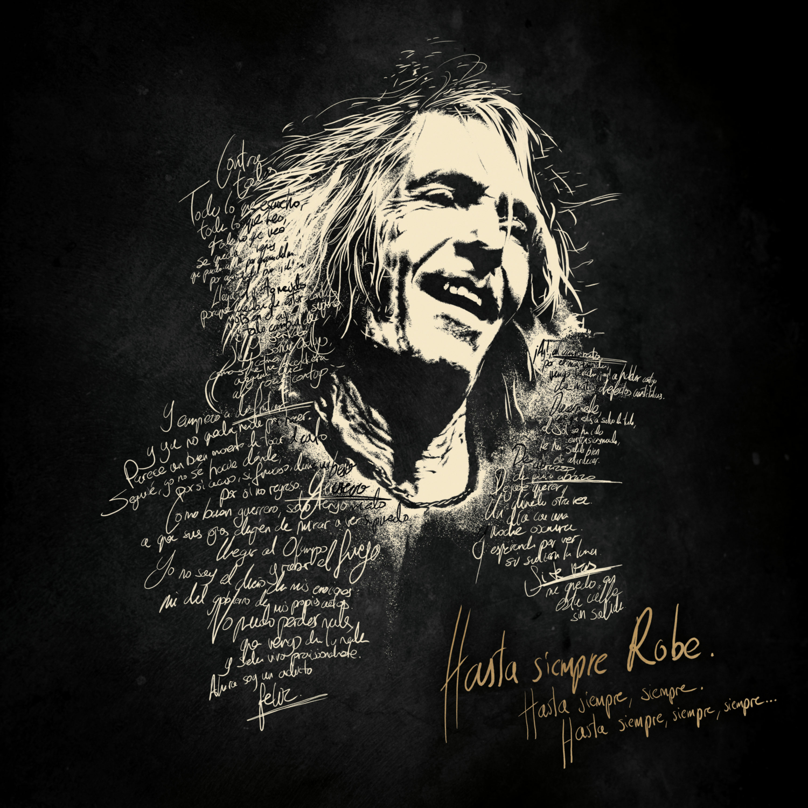

# Roberto Iniesta

## Historia de un poeta y su banda

Roberto Iniesta nació en Plasencia en 1963, y por desgracia para todos, nos dejó el pasado 10 de diciembre de 2025. 

Se le notaba en los ojos, por dentro era de colores, y al irse por la vereda de la puerta de atrás nos dejó
huérfanos de poesía y rock a muchos de nosotros.

Algunas de sus contribuciones a la historia de la música son:

+ La Ley Innata
+ Mayéutica
+ Se nos leva el aire
+ Iros Todos a Tomar Por Culo
+ ¿Dónde están mis Amigos?
+ Rock Transgresivo

Os dejamos [aquí](https://robe.es) su página web

Como decía **Robe** al final de sus conciertos:

> _Hasta siempre, Robe, hasta siempre, siempre_

